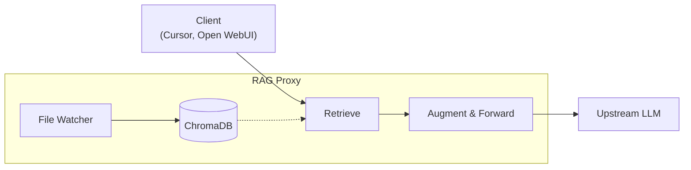



## 1. The amnesia problem

If you've read my posts on [agentic coding]() or my [local AI journey](), you know I am all-in on using AI to control my computer and write software.
But one critical piece was missing: **Context**.

LLMs are powerful but stateless.
Every time I start a new chat, the model forgets who I am, what I'm working on, and that I prefer [functional Python code]() over object-oriented styles.
Worse, it also forgets the thing I just told it five minutes ago in another window.

The standard solution to this is [RAG (Retrieval-Augmented Generation)](https://en.wikipedia.org/wiki/Retrieval-augmented_generation) and [Memory](https://arxiv.org/abs/2310.08560).
But when I looked at the available tools, I hit a wall.

Most solutions fell into two buckets:
1.  **SaaS / Web UIs:** Upload your files to a cloud service or use a specific web chat interface that locks you in.
2.  **Developer Libraries:** "Just use LangChain/LlamaIndex!" they say. Great, now I have to write a Python script every time I want to ask a question about a PDF?

I didn't want a library. I didn't want a web UI.
**I wanted a folder.**
I wanted to drop a file into `~/my-docs`, and have my AI instantly know about it.
And I wanted my AI's "memory" to be a file I can edit, not a hidden vector in a database I can't inspect.

So I decided to build my own file-based solution.

{}
**TL;DR:** I built [`agent-cli`](https://github.com/basnijholt/agent-cli) features that combine two ideas:

1. **File-based storage:** Documents in a folder, memories as Markdown files with Git versioning.
2. **OpenAI-compatible proxy:** Works with *any* OpenAI-compatible tool—Cursor, Cline, Open WebUI, LibreChat, Lobe Chat, your terminal—without lock-in.

Tools like Open WebUI have built-in RAG, but that forces you to use only Open WebUI.
My proxy means I can switch tools whenever I want, and they all share the same memory and document index.
{}

## 2. Learning from failure: AI Journal

This isn't my first attempt at building a memory system.

A few months ago, I built [**AI Journal**](https://github.com/basnijholt/aijournal)—an ambitious local-first journaling app where an AI would read your entries and build a "living self-model" of who you are.
It had sophisticated features: a structured "persona core," typed "claim atoms" with evidence links, four organizational layers (L1→L4), recency-aware scoring with decay functions, and Git-based time travel to "ask questions of your younger self."

The architecture seemed solid.
The problem was simpler: **local models aren't good enough yet.**

I designed the whole thing to run entirely on Ollama with my dual RTX 3090s.
But even with a 48GB of VRAM, the models couldn't reliably extract structured claims, handle the multi-step reconciliation, or maintain coherence across long conversations.
Whether the design was right, I still don't know—but the execution definitely hit the wall of current local LLM capabilities.

The lesson: I tried to build the entire system at once without validating the core concepts and individual ideas first.
This time, I took a different approach: **tackle it problem by problem.**
Instead of designing a complete system upfront, I would validate each piece—chunking, retrieval, re-ranking, memory reconciliation—before combining them.
The experience and UX would be my own, but the algorithms would be adapted from established projects.

## 3. How I studied SOTA: clone, read, re-implement

My approach was more methodical this time.
I cloned five major frameworks into the same workspace as `agent-cli`:

- **[LlamaIndex](https://github.com/run-llama/llama_index)**: The OG RAG framework
- **[LangChain](https://github.com/langchain-ai/langchain)**: The kitchen-sink approach
- **[Letta](https://github.com/letta-ai/letta)** (formerly MemGPT): Stateful agents with long-term memory
- **[Mem0](https://github.com/mem0ai/mem0)**: Focused specifically on memory extraction
- **[PydanticAI](https://github.com/pydantic/pydantic-ai)**: Clean, typed agent framework

I didn't read through all this code myself—that would take months.
Instead, I used AI coding agents to search the codebases and write summaries of the technical implementation details:

- **Gemini CLI** (Gemini 3.0 Pro)
- **Claude Code** (Opus 4.5)
- **Codex CLI** (GPT-5.1-Codex-Max)

I fed those summaries into **ChatGPT 5 Pro** together with my high level plan of what I wanted to create, and it created an implementation plan.
Then I took that plan back to the coding agents for implementation.
I personally found Opus 4.5 the best coding model, but GPT‑5.1 Codex Max was the best at reviewing the code and actually identifying critical bugs.

For validation, I used [`clip-files`](https://github.com/basnijholt/clip-files) to copy the agent-cli source code plus the architecture documents (like [memory.md](https://github.com/basnijholt/agent-cli/blob/main/docs/architecture/memory.md) and [rag.md](https://github.com/basnijholt/agent-cli/blob/main/docs/architecture/rag.md)) into ChatGPT 5 Pro to validate the approach.

The AI did the searching and implementing; I did the understanding and decision-making.

{}
**The key insight:** Existing frameworks are incredibly over-engineered for my use case, but the *core algorithms* are gold.
My job was to extract the essence and re-implement it cleanly.
{}

## 4. The dependency problem: why ONNX over PyTorch

One thing became immediately clear when going through these frameworks: **they're massive**.

Installing LlamaIndex with all its dependencies pulls in PyTorch.
PyTorch alone is **2-3GB**.
Add transformers, sentence-transformers, and the kitchen sink, and you're looking at an **8GB+ environment** just to ask questions about some PDFs.

This felt excessive for a CLI tool.

One of my core design goals was **minimal dependencies**.
I wanted `agent-cli` to install in seconds, not minutes.
I wanted it to work on my Mac, my NixOS server, and my friend's laptop without downloading half the internet.

The solution: **ONNX Runtime**.

ONNX Runtime is ~200MB and runs inference on basically anything—CPU, CUDA, even Apple Silicon.
For embeddings, I use [`embeddinggemma`](https://developers.googleblog.com/introducing-embeddinggemma/) running locally via [llama.cpp]().
For re-ranking, I use a cross-encoder exported to ONNX (`Xenova/ms-marco-MiniLM-L-6-v2`).

The result: `pip install agent-cli[rag]` takes about 30 seconds and adds ~300MB.
The key insight: embeddings and re-ranking are cheap operations.
You don't need a GPU for them—CPU is perfectly fine.
PyTorch with CUDA support can easily reach 2-3GB+; ONNX Runtime is ~200MB and runs anywhere.
Since I'm not training models, just running inference on small encoders, ONNX is the obvious choice.

## 5. RAG: just let me grep it (kind of)

My requirement for RAG was simple: **Files on disk are the source of truth.**

I didn't want to manage an ingestion pipeline or trigger APIs.
I implemented a [RAG proxy](https://github.com/basnijholt/agent-cli/blob/main/docs/architecture/rag.md) that uses OS-level file watchers (`watchfiles`).
Here is the workflow:

1.  I drop a PDF, Markdown, or Python file into `~/rag_docs`.
2.  The system detects the `Create` event.
3.  It chunks the text and embeds it into a local ChromaDB instance.
4.  It's immediately searchable.

When moving or deleting files, the system updates the index accordingly.

### The architecture: OpenAI compatibility

The "secret sauce" isn't the retrieval itself; it's how I expose it.
Instead of building a custom chat app, I built an **OpenAI-compatible proxy**.



```bash
# Point any OpenAI-compatible tool at your local proxy
export OPENAI_BASE_URL=http://localhost:8000/v1
```

That's it. Any tool that supports custom OpenAI endpoints—Cursor, Cline, Open WebUI, LibreChat—instantly gains the ability to "read" my document folder.

### Two-stage retrieval: the SOTA approach

I looked at LlamaIndex here.
Standard "semantic search" (using just embeddings/bi-encoders) is often disappointing.
It finds text that *looks* similar but isn't actually relevant.

A common pattern in modern RAG systems is **Two-Stage Retrieval**.

1.  **Fast Stage:** Retrieve 3x candidates using standard embeddings (`text-embedding-3-small` or local models like [`embeddinggemma`](https://developers.googleblog.com/introducing-embeddinggemma/)).
2.  **Smart Stage:** Use a **Cross-Encoder** to re-rank the results.

A cross-encoder looks at the query and the document *together* and outputs a relevance score.
It's computationally heavier, but since I'm running this locally on my RTX 3090 (or even CPU via ONNX), the 50ms latency penalty is worth it for results that are actually useful.

This isn't a new idea, but implementing it cleanly with ONNX avoided the huge dependency tax.

## 6. Memory: files over databases

This is where my approach diverges most from standard tools like Mem0.
Most memory systems treat memories as database rows.
If the AI remembers "User likes pizza," that's a vector in a DB.
If it hallucinates and records "User hates pizza," good luck fixing it.
You need to write a script to query the DB and delete the row.

**I prefer data I can inspect.**

My memory system stores every fact as a **Markdown file** with YAML front matter.

```markdown
---
id: "550e8400-e29b-41d4-a716-446655440000"
role: "memory"
created_at: "2025-12-15T10:00:00Z"
conversation_id: "default"
---
The user prefers using 'uv' for Python package management.
```

### Git integration: versioning memory 🕰️

Because memories are just files, I added a feature that I haven't seen anywhere else: **Automatic Git Versioning**.

Every time the AI learns a new fact, updates an old one, or deletes a contradiction, the system automatically commits the change to a local git repository.

This leads to incredible capabilities:
1.  **Inspectability:** I can `git log` and see exactly *when* the AI learned something.
2.  **Correction:** If the AI learns something wrong, I open the markdown file in VS Code, edit it, and save.
3.  **Reversion:** Agent hallucinated wildly yesterday? `git reset --hard HEAD~1`.

### The reconciliation loop

The logic for storing memories isn't just "append to file."
Digging into Mem0 (and Letta) showed me that memory systems need active **reconciliation**.
When I say "Actually, I switched to nix instead of uv," the system:

1.  **Retrieves** existing memories about package managers.
2.  **Decides** (using a lightweight LLM) whether to `ADD`, `UPDATE`, or `DELETE`.
3.  **Executes** the file operation (moving the old fact to a `deleted/` folder for audit trails).

This keeps the memory bank clean and contradictory-free, unlike simple vector stores that just accumulate conflicting junk over time.

### The tiny detail that broke everything

After implementing the memory system—mostly modeled after Mem0—I noticed it didn't work as well.
After a lot of debugging, I found a tiny difference: I was asking the model for structured data via a tool call, whereas Mem0 uses freeform JSON that the LLM returns directly.

Since I use PydanticAI, fixing this was a one-line change:

```python
agent = Agent(
    model=model_cfg,
    system_prompt=UPDATE_MEMORY_PROMPT,
-   output_type=list[MemoryDecision],
+   output_type=PromptedOutput(list[MemoryDecision]),  # JSON mode instead of tool calls
    retries=3,
)
```

This is exactly why reading the source code matters—not just the algorithms, but the tiny details that make them work.

## 7. Why building this was necessary

You might ask: "Bas, why write thousands of lines of code for this? Why not just use ChatGPT's memory or install LangChain?"

Three reasons: **Privacy**, **Integration**, and **Dependencies**.

### Privacy
I want to feed my AI my financial records, my health data, and my private journals.
I am not comfortable sending that to OpenAI's long-term storage or some VC-backed startup's vector cloud.
With `agent-cli`, the vectors live in `~/.cache/agent-cli/chroma`, the files live in `~/documents`, and the only thing leaving my machine is the specific context needed for a specific query (if I use a cloud model) or nothing at all (if I use Ollama/[llama.cpp]()).

### Integration
By building this as an API proxy, I solved the "fragmented tools" problem.
Any tool that supports custom OpenAI-compatible endpoints works out of the box:

- **`agent-cli chat`** in the terminal
- **Cursor** or **Cline** for agentic coding
- **[Open WebUI](https://openwebui.com/)**, **[LibreChat](https://www.librechat.ai/)**, or **[Lobe Chat](https://lobechat.com/)** in the browser

Because my system speaks "OpenAI," all of these tools share the *same* memory and the *same* document index.
If I tell the terminal agent "I'm working on Project X," and then switch to Cursor, Cursor knows about Project X.
I can try a new chat UI tomorrow without losing anything—just point it to `localhost:8000`.

### Dependencies
To me, it just doesn't feel right that asking questions about a PDF requires downloading 8GB of PyTorch.
By choosing ONNX Runtime over the PyTorch ecosystem, I kept the entire install lightweight and fast.
This matters when you want to run the system on a cheap VPS or your friend's laptop.

## 8. Try it yourself

The entire system is open-source and available in [`agent-cli`](https://github.com/basnijholt/agent-cli).

### Try Memory

Get an LLM that remembers you using [Ollama](https://ollama.com).

```bash
# 1. Pull models and start proxy
ollama pull embeddinggemma:300m && ollama pull gpt-oss:20b
uvx -p 3.13 --from "agent-cli[memory]" agent-cli memory proxy \
  --memory-path ./my-memories \
  --openai-base-url http://localhost:11434/v1 \
  --embedding-model embeddinggemma:300m
```

```bash
# 2. Chat from the terminal (env vars point to proxy)
export OPENAI_BASE_URL=http://localhost:8100/v1 OPENAI_API_KEY=dummy

# Tell it something about yourself
uvx openai api chat.completions.create -m gpt-oss:20b -g user "My name is Alice and I love hiking"

# Later, ask if it remembers
uvx openai api chat.completions.create -m gpt-oss:20b -g user "What's my name?"
```

### Try RAG

Chat with your documents.

```bash
# 1. Start the RAG proxy (runs in foreground)
uvx -p 3.13 --from "agent-cli[rag]" agent-cli rag-proxy \
  --docs-folder ./my-docs \
  --openai-base-url http://localhost:11434/v1 \
  --embedding-model embeddinggemma:300m
```

```bash
# 2. Chat with your docs
OPENAI_BASE_URL=http://localhost:8000/v1 OPENAI_API_KEY=dummy \
  uvx openai api chat.completions.create \
  -m gpt-oss:20b \
  -g user "What does my documentation say about X?"
```

## 9. What I learned

This journey reinforced a few beliefs:

1. **Validate components first.** AI Journal failed not because the ideas were wrong, but because I tried to build a complete system before validating individual components. This time I tackled problems one at a time—chunking, retrieval, re-ranking, memory reconciliation—and only combined them once each piece worked.

2. **Study implementations, not just papers.** Reading about two-stage retrieval is one thing. Reading how LlamaIndex actually implements it—the edge cases, the defaults, the performance tradeoffs—is far more valuable. Clone the repos. Read (or make AI read) the code.

3. **Dependencies matter.** A 30-second install versus a 10-minute download changes whether someone actually tries your tool. I am happy with the ONNX Runtime over PyTorch choice.

4. **Files are the ultimate API.** By stripping away the complex databases and proprietary interfaces, I ended up with a system that is robust, version-controllable, and surprisingly simple to reason about.

5. **Use the best model for each job.** I used 4 different AI models during development, each with different strengths. Gemini 3.0 Pro, Opus 4.5, GPT-5.1-Codex Max. I used all of them during the implementation phase, but each one has its own strengths. Fore example, Opus 4.5 was the best coding model, but GPT-5.1 Codex Max was the best at reviewing the code and actually identifying critical bugs (use the built-in `/review` feature).
