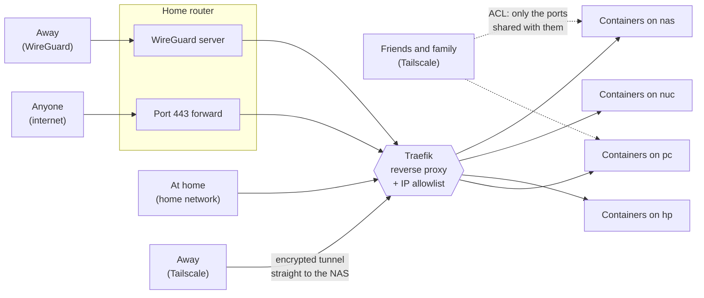

When I wrote [about my homelab]() in 2024, it was a story about hardware: a NUC, an HP EliteDesk, a TrueNAS box, and a lot of trial and error.
Almost everything in that post has since been replaced.
Proxmox and TrueNAS are gone, and [every machine runs NixOS](), [including the NAS]().

The part I'm most excited about is the balance I found: everything is declarative, without more machinery than I need.
One extreme is what I had before, clicking through web UIs and running one-off install scripts.
The other is Kubernetes, which many self-hosted projects don't support and which is a lot to babysit at home, or running every app as a NixOS module, which often lags behind upstream.[^nix-lag]
I landed in between: NixOS declares the machines, each project's own Compose file declares its app, and [compose-farm](https://github.com/basnijholt/compose-farm), a thin tool I wrote, decides which machine runs what, which is all the multi-host orchestration I need.
Every layer is a text file in git, each uses the simplest tool that keeps it that way, and I still get new app releases as soon as upstream ships them.

[^nix-lag]: Yes, [nixpkgs is the largest and most up-to-date package repository](https://repology.org/repositories/graphs) there is. Even so, I follow `nixos-unstable`, and a new version only reaches me once it is merged, built, and tested, and the channel moves forward, which usually takes a couple of days. Updates that trigger large rebuilds go through a staging branch first and take longer, and not every package gets updated as quickly as the popular ones. With Docker, I can run a release the day upstream publishes it.

What that post never explained is the thing friends actually ask me about: how do I reach all of it?
I open `https://mealie.lab.nijho.lt` on my phone to look up a recipe, and it works the same at home, on a train, or on hotel Wi-Fi in another country, with a valid padlock in the address bar.
If a stranger on the internet tries the same address, they get nothing.

This post tries to explain it all.
I wrote it for people who have never set up a reverse proxy or a VPN, so every piece gets a short explanation before I show how I configured it.
I deliberately made it comprehensive, with enough detail that you could reproduce the whole setup.
That also makes it long, so read the parts you find interesting and skip the rest; if you already know what DNS or WireGuard is, skip ahead.

If it is too long, send it to your AI agent, discuss it, and figure out together which parts make sense for your own network.
My setup spans four machines, but most of the pieces are just as useful on one.
For example, compose-farm works just as well with a single host; it just gives you the flexibility to fan out later.

Throughout the post I use a few services as running examples: [Mealie](https://mealie.io/) for recipes, [ntfy](https://ntfy.sh/) for push notifications, and my git server at `git.nijho.lt`.



## The big picture

This is the whole setup in one diagram.
Every box gets its own section below.



In short:

1. **Four machines** run all my services as containers.
2. **compose-farm** decides which service runs on which machine.
3. **One reverse proxy, Traefik,** is the front door for every service on every machine.
4. **Let's Encrypt certificates** give every service real HTTPS, including the private ones.
5. **DNS** turns names like `mealie.lab.nijho.lt` into addresses, and gives a *different* answer depending on where I am.
6. There are **four ways in**: my home network, WireGuard on my router, Tailscale coordinated by my own Headscale server, and the open internet.
7. **One allowlist** in Traefik decides which of those four each service accepts. Almost everything accepts only the first three.
8. **Headscale ACLs** decide which of my friends and family can reach which service.
9. **NixOS, Compose files, and Terraform** describe nearly all of it in git, so I rarely click a button, and AI agents can work on it the same way I do.

If that list looks overwhelming, I get it.
A reverse proxy, Let's Encrypt, DNS, an allowlist, ACLs, NixOS, compose-farm, Terraform: that is a lot of moving parts for something that serves recipes.
What lets me sleep at night is the last point.
Apart from a handful of router settings, every piece of configuration is declarative and lives in git, so the whole setup is reproducible.
If a machine dies, I install NixOS on a new one and get the same machine back.
If I break something, `git log` tells me what changed and `git revert` undoes it.
Nothing depends on me remembering which buttons I clicked two years ago.
You don't need to understand every piece at once, either; each one is a file you can read when you get to it.
I come back to this in [Declarative everything](#declarative-everything).

To make the list concrete, this is what happens when I open Mealie in three situations:

- **At home,** my phone asks my home DNS server for `mealie.lab.nijho.lt` and gets `192.168.1.6`, the NAS. Traefik sees a request from `192.168.1.x`, which is on the allowlist, and passes it to the Mealie container.
- **On hotel Wi-Fi that blocks WireGuard,** my laptop uses Tailscale instead. It asks Headscale's DNS for the same name and gets `100.64.0.28`, the address of the NAS *inside* my Tailscale network. The request travels through an encrypted tunnel straight to the NAS. Traefik sees a `100.64.0.x` address, also on the allowlist, and passes it on.
- **A stranger on the internet** gets `192.168.1.6` from public DNS, which is a private address that leads nowhere outside my home. If they find my home IP and connect to it directly, Traefik sees their real address, which is *not* on the allowlist, and answers `403 Forbidden`.

Same name, same padlock, three paths, and only the stranger is refused.

## The machines, and NixOS

Four machines run my services:

| Machine | What it is | What it does |
| ------- | ---------- | ------------ |
| [`nas`](https://github.com/basnijholt/dotfiles/tree/main/configs/nixos/hosts/docker-lxc) | A container on the NAS with all the disks | The front door (Traefik) and most services, close to the data |
| [`nuc`](https://github.com/basnijholt/dotfiles/tree/main/configs/nixos/hosts/nuc) | A small, always-on Intel NUC | Home DNS server and a few lightweight services |
| [`hp`](https://github.com/basnijholt/dotfiles/tree/main/configs/nixos/hosts/hp) | An HP EliteDesk | Second home DNS server and a mix of services |
| [`pc`](https://github.com/basnijholt/dotfiles/tree/main/configs/nixos/hosts/pc) | My desktop with two RTX 3090s | [Local AI](), including my dictation server |

Each name links to that machine's NixOS configuration.
The hardware of the NUC, the HP, and the NAS is in [my original homelab post]().

On the NAS, the containers don't run on the [host itself](https://github.com/basnijholt/dotfiles/tree/main/configs/nixos/hosts/nas).
They run inside an [Incus](https://linuxcontainers.org/incus/) system container called `docker-lxc`, which keeps the machine that stores my data a little apart from the machine that runs a hundred containers.
That container is a full NixOS system of its own, configured like the other machines.
In the rest of this post, "nas" means that container.

### What NixOS brings

All four machines run [NixOS](https://nixos.org/), and so does the NAS host underneath `docker-lxc`.
In NixOS, the *entire* operating system is described in text files: which packages are installed, which services run, which disks get mounted, which firewall ports are open.
You don't install things by typing commands and hoping you remember them later.
You write down what the machine should look like, and NixOS makes it so.
If a machine dies, I install NixOS on a new one, point it at the same files, and get the same machine back.

My NixOS configuration lives in [my public dotfiles](), in [`configs/nixos`](https://github.com/basnijholt/dotfiles/tree/main/configs/nixos).
A shared layer applies to every machine, and each machine adds its own specifics.
Every machine joins my Tailscale network with one line in [`common/services.nix`](https://github.com/basnijholt/dotfiles/blob/main/configs/nixos/common/services.nix):

```nix
services.tailscale.enable = true;
```

The NUC, the HP, and the PC mount the same shared folders from the NAS over NFS, a protocol for sharing folders over the network, in [`optional/nfs-docker.nix`](https://github.com/basnijholt/dotfiles/blob/main/configs/nixos/optional/nfs-docker.nix):

```nix
fileSystems."/opt/stacks" = {
  device = "truenas.local:/mnt/ssd/docker/stacks";
  fsType = "nfs";
  options = [ "nfsvers=4" "nofail" "bg" "soft" ];
};
```

`docker-lxc` doesn't need NFS; the NAS hands it the same folders directly from its disks ([`hosts/nas/virtualization.nix`](https://github.com/basnijholt/dotfiles/blob/main/configs/nixos/hosts/nas/virtualization.nix)).
That shared folder, `/opt/stacks`, is what makes the next section work: every machine sees the same service definitions at the same path.

### Deploying NixOS with comin

Changing a NixOS machine normally means logging in and running `nixos-rebuild switch`.
I don't do that anymore.
Every machine runs [comin](https://github.com/nlewo/comin), a small GitOps agent.
It watches my dotfiles on GitHub, and when a new commit lands on `main`, each machine pulls it, builds its own configuration, and switches to it.
The heavy builds come from [my local build cache](), so the machines themselves rarely compile anything.
The core of [`common/comin.nix`](https://github.com/basnijholt/dotfiles/blob/main/configs/nixos/common/comin.nix):

```nix
services.comin = {
  enable = true;
  remotes = [{
    name = "origin";
    url = "https://github.com/basnijholt/dotfiles.git";
    branches.main.name = "main";
  }];
  repositorySubdir = "configs/nixos";
  sshAllowedSignersPath = "${cominAllowedSigners}";
};
```

The last line matters.
comin only deploys commits signed with my SSH key, so being able to push to the repo is not enough to take over my machines.
comin originally only understood GPG signatures, so I [added support for SSH-signed commits](https://github.com/nlewo/comin/pull/171) upstream.

Changing a machine means pushing a signed commit.
That comes back at the end of this post.

## What runs on it

Some of what runs on these four machines:

| Area | Services |
| ---- | -------- |
| **Infrastructure** | [Traefik](https://traefik.io/traefik/) (reverse proxy), [Headscale](https://headscale.net/) and [Headplane](https://github.com/tale/headplane) (my tailnet), [Forgejo](https://forgejo.org/) (git), the [compose-farm](https://github.com/basnijholt/compose-farm) web UI, [Homepage](https://gethomepage.dev/) (dashboard), [code-server](https://github.com/coder/code-server) (VS Code in the browser) |
| **Monitoring** | [Uptime Kuma](https://github.com/louislam/uptime-kuma), [Glances](https://nicolargo.github.io/glances/), [Netdata](https://www.netdata.cloud/), [Prometheus](https://prometheus.io/) and [Grafana](https://grafana.com/), [Dozzle](https://dozzle.dev/) (container logs), [Diun](https://crazymax.dev/diun/) and [What's Up Docker](https://getwud.github.io/wud/) (image updates), [LibreSpeed](https://github.com/librespeed/speedtest) |
| **Tools** | [ntfy](https://ntfy.sh/) (push notifications), [Syncthing](https://syncthing.net/) (file sync), [Atuin](https://atuin.sh/) (shell history sync), [Wakapi](https://wakapi.dev/) (coding stats) |
| **AI** | [agent-cli](https://github.com/basnijholt/agent-cli) and [Diction]() (dictation), [Speaches](https://speaches.ai/) (speech-to-text), [Kokoro](https://github.com/remsky/Kokoro-FastAPI) (text-to-speech), [Ollama](https://ollama.com/), [LiteLLM](https://www.litellm.ai/) (one API in front of all models), [Open WebUI](https://openwebui.com/), [LibreChat](https://www.librechat.ai/), [LobeChat](https://lobehub.com/), [Khoj](https://khoj.dev/), [SearXNG](https://docs.searxng.org/) (private metasearch), [Unsloth](https://unsloth.ai/) (fine-tuning) |
| **Home and documents** | [Mealie](https://mealie.io/) (recipes), [Grocy](https://grocy.info/) (household inventory), [Paperless-ngx](https://docs.paperless-ngx.com/) with paperless-ai and paperless-gpt, [Immich](https://immich.app/) (photos), [Nextcloud](https://nextcloud.com/), [Hoarder](https://karakeep.app/) (bookmarks), [Home Assistant](https://www.home-assistant.io/) |
| **Chat** | [Cinny](https://cinny.in/) (Matrix client for [MindRoom]()), [The Lounge](https://thelounge.chat/) (IRC) |

The GPU-heavy AI services, like dictation, text-to-speech, and fine-tuning, run on `pc`; the [local AI post]() covers that side.
Home Assistant runs on its own machine; everything else in the table is a container.

## Containers and compose-farm

### What a container is

Almost everything I run is a [Docker](https://www.docker.com/) container.
A container is an application packaged with everything it needs, isolated from the rest of the system.
Mealie's developers publish a Mealie image, I run it, it doesn't care what else is installed on the machine, and removing it leaves nothing behind.

[Docker Compose](https://docs.docker.com/compose/) describes containers in a YAML file: which image, which folders it can see, which ports it uses, which settings.
This is a trimmed version of my Mealie definition:

```yaml
services:
  mealie:
    image: ghcr.io/mealie-recipes/mealie
    container_name: mealie
    ports:
      - 9925:9000
    volumes:
      - /mnt/data/mealie:/app/data/
    environment:
      ALLOW_SIGNUP: false
      BASE_URL: https://mealie.${DOMAIN}
    restart: unless-stopped
```

Every service ("stack") gets its own folder with a `compose.yaml` in one git repo, mounted at `/opt/stacks` on every machine.

### Upstream's Compose file, my folders

Back when I ran Proxmox, I was a big fan of the [Proxmox VE Helper-Scripts](https://community-scripts.github.io/ProxmoxVE/), started by tteck ([RIP](https://github.com/community-scripts/ProxmoxVE/discussions/237)) and now maintained by the community.
Each one is a one-liner that creates an LXC container with an app installed inside, and they are how I [got into self-hosting]() and set up almost everything at first.

The catch is that they are a community effort, and the way they install an app is usually not a way the app's own developers support.
[Immich](https://immich.app/) shows the problem well: its docs say it requires Docker with the Docker Compose plugin, while today's helper script builds Immich from source, installs PostgreSQL and Redis, and compiles six image-processing libraries directly in the container.
That is effectively a mirror of the official setup, maintained by someone else; the script even pins the Immich version and only bumps it after testing each release.
Every upgrade depends on a second set of maintainers keeping up with upstream, and for my containers that made upgrades painful and stressful.

Nowadays almost every project publishes a Docker Compose file, so that's what I use, nearly unmodified.
After the first setup, the Compose file almost never changes; the image does.
Most of my services use the `latest` tag, and upgrading is `cf update <stack>` (or `--all`), which pulls the newest image and recreates the container.

That is YOLOing it a bit.
In the beginning I pinned every image to an exact digest, because I was afraid a new version would break something.
Bumping all those pins became its own chore, so I switched almost everything to `latest`.
I only still pin the pieces where a surprise would really hurt: Traefik, Headscale, Forgejo, and databases, which stay on a major version like `postgres:16` because moving to a new major version of PostgreSQL needs a manual migration.
Since the switch I haven't had real problems, and the rare breakage took a five-word prompt to an AI agent to fix.

The one thing I do change is where the data goes.
Many Compose files keep data in named Docker volumes, which Docker manages somewhere under `/var/lib/docker/volumes`.
I stopped using them: too many times I deleted a volume by accident (`docker compose down -v` and `docker volume prune` make that easy), and I never had a good view of what was inside.
Instead, every stack gets plain folders, which Docker calls bind mounts, in two fixed places:

- `/opt/stacks/<stack>/` holds the `compose.yaml` and its `.env`, in git.
- `/mnt/data/<stack>/` holds the app's data.

Each `/mnt/data/<stack>` is its own ZFS dataset on the NAS, with frequent snapshots and [backups]().
The Mealie example above shows the swap: upstream's file uses a volume called `mealie-data`, and mine says `/mnt/data/mealie:/app/data/`.

### Why I wrote compose-farm

Docker Compose manages containers on *one* machine, and I have four.
The usual answers are Kubernetes or Docker Swarm.

Kubernetes feels like overkill for a homelab, and many projects don't support it: they publish a Compose file, not a Helm chart (Kubernetes' package format), so I would end up writing and maintaining my own charts.
That's the helper-script problem again.
Docker Swarm would meet my needs almost perfectly, but it is effectively in maintenance mode: it still ships with Docker, but Docker no longer invests in it.

So I wrote [compose-farm](https://github.com/basnijholt/compose-farm).
It is deliberately thin: one YAML file says which stack runs on which machine, and the `cf` command SSHes to that machine and runs plain `docker compose` there.

```yaml
compose_dir: /opt/stacks

hosts:
  nas: { address: 192.168.1.6 }
  nuc: { address: 192.168.1.2 }
  hp:  { address: 192.168.1.3 }
  pc:  { address: 192.168.1.5 }

stacks:
  traefik: nas
  headscale: nas
  forgejo: nas
  mealie: nas
  ntfy: nuc
  agent-cli: pc
  glances: all   # runs on every machine

traefik_file: /opt/stacks/traefik/dynamic.d/compose-farm.yml
```

Day to day, that looks like this:

```bash
cf up mealie       # start Mealie on whichever machine the config says
cf logs -f ntfy    # follow logs, wherever ntfy runs
cf ps              # what is running where
cf apply           # make reality match the config: start, move, and stop stacks
```

Moving a service to another machine is a one-line change.
I edit `mealie: nas` to `mealie: hp` and run `cf up mealie`, and compose-farm stops it on the old machine and starts it on the new one.
Because every machine sees the same `/opt/stacks` and `/mnt/data`, the service finds its configuration and data waiting for it.

There is no cluster, no database, and no agent running on each machine.
If compose-farm disappeared tomorrow, every stack would still be a normal Compose folder I could start by hand.

The last line of that config, `traefik_file`, is where compose-farm connects to the front door.

## The front door: a reverse proxy

### What a reverse proxy brings

Every service listens on its own port on its own machine: Mealie on port 9925 of the NAS, ntfy on port 8089 of the NUC, and so on.
I could bookmark `http://192.168.1.2:8089`, but that gets old fast, it is unencrypted, and every service would need its own security.

A **reverse proxy** is a receptionist in front of all of them.
Every request arrives there first.
It looks at which name you asked for, `mealie.lab.nijho.lt` or `ntfy.lab.nijho.lt`, and passes the request to the right service on the right machine.
Because everything goes through it, the reverse proxy is also the one place to:

- handle HTTPS and certificates, so the services don't have to;
- decide who is allowed in;
- give every service a clean name instead of an IP and a port.

I use [Traefik](https://traefik.io/traefik/).
It runs on the NAS and is the only thing listening on the standard web ports: 80 for plain HTTP and 443 for HTTPS.

### Services announce themselves

What I like most about Traefik is that services describe their own routing with **labels** in their Compose file.
These are Mealie's:

```yaml
    labels:
      - traefik.enable=true
      # https://mealie.lab.nijho.lt, only for trusted networks
      - traefik.http.routers.mealie.rule=Host(`mealie.${DOMAIN}`)
      - traefik.http.routers.mealie.entrypoints=websecure
      - traefik.http.routers.mealie.middlewares=local-ips-only@file
      # http://mealie.local, plain HTTP at home
      - traefik.http.routers.mealie-local.rule=Host(`mealie.local`)
      - traefik.http.routers.mealie-local.entrypoints=web
      - traefik.http.services.mealie.loadbalancer.server.port=9000
```

In words: if someone asks for `mealie.lab.nijho.lt` over HTTPS and passes the `local-ips-only` check, send them to port 9000 of this container.
Every service gets two names by convention: an HTTPS name under `lab.nijho.lt` that works everywhere, and a short `.local` name for quick access at home.

Traefik reads those labels by watching Docker on its own machine, and ignores any container that doesn't opt in with `traefik.enable=true`:

```yaml
command:
  - --providers.docker=true
  - --providers.docker.exposedbydefault=false
  - --providers.file.directory=/dynamic.d
  - --entrypoints.web.address=:80
  - --entrypoints.web.http.middlewares=local-ips-only@file
  - --entrypoints.websecure.address=:443
  - --entrypoints.websecure.http.tls.certresolver=le
```

### Services on other machines

There is a catch: Traefik only sees Docker containers on *its own* machine.
It has no idea that ntfy runs on the NUC.

compose-farm fills that gap.
It reads the Traefik labels of every stack, looks up which machine the stack runs on and which port it publishes, and writes the result to a file that Traefik watches.
After `cf up ntfy`, that file contains:

```yaml
# /opt/stacks/traefik/dynamic.d/compose-farm.yml
# Auto-generated by compose-farm (only the ntfy entries shown)
http:
  routers:
    ntfy:
      rule: Host(`ntfy.lab.nijho.lt`)
      middlewares:
      - local-ips-only@file
      entrypoints:
      - websecure
      service: ntfy
  services:
    ntfy:
      loadbalancer:
        servers:
        - url: http://192.168.1.2:8089
```

I never edit that file.
I write labels the same way no matter where a service runs, and when a service moves, its route moves with it.

Things that don't run in Docker, like [Home Assistant](https://www.home-assistant.io/) on its own machine, get hand-written routes in a second file in the same folder.

## Certificates: the padlock

### What a certificate is

When you visit an `https://` address, your browser checks the server's **certificate**: a small file, signed by an authority your browser trusts, that proves the server really is `mealie.lab.nijho.lt`.
The certificate is also what makes the encryption between you and the server possible.
Without a valid one you get a scary warning, and many apps refuse to connect at all.

[Let's Encrypt](https://letsencrypt.org/) hands out certificates for free, automatically, to anyone who can prove they control a domain.

### Proving I own the domain without opening my network

The usual proof is for Let's Encrypt to *connect to your server* and fetch a file from it (the "HTTP-01 challenge").
That doesn't work for private services, because the whole point is that the internet can't connect to them.

So I use the **DNS-01 challenge** instead.
Let's Encrypt asks me to publish a specific text record in my domain's DNS.
My DNS is hosted at [Cloudflare](https://www.cloudflare.com/), so Traefik creates that record through the Cloudflare API, waits for Let's Encrypt to see it, and removes it again.
Let's Encrypt never has to reach my network.

DNS-01 also lets me request a **wildcard certificate**: one certificate for `*.lab.nijho.lt` that covers every name under it.
A new service has HTTPS the moment its route exists, without requesting anything.

```yaml
  - --certificatesresolvers.le.acme.dnsChallenge.provider=cloudflare
```

```yaml
  - traefik.http.routers.traefik-lab.tls.certresolver=le
  - traefik.http.routers.traefik-lab.tls.domains[0].main=lab.nijho.lt
  - traefik.http.routers.traefik-lab.tls.domains[0].sans=*.lab.nijho.lt
```

Traefik renews it before it expires, and I don't think about certificates anymore.

The `.local` names can't get a public certificate, because nobody owns `.local`.
Those stay plain HTTP, and Traefik only answers them for devices on my home network.
It is also why I don't redirect HTTP to HTTPS everywhere: that would break every `.local` name.

## DNS: the phone book

### What DNS does

Computers talk to each other with IP addresses like `192.168.1.6`.
Humans prefer names like `mealie.lab.nijho.lt`.
**DNS**, the Domain Name System, is the phone book that turns one into the other.
Before your browser connects anywhere, it asks a DNS server for the address that belongs to a name.

Two details matter for the rest of this post.

First, some addresses are **private**.
Ranges like `192.168.x.x` and `10.x.x.x`, and Tailscale's `100.64.x.x`, are not reachable on the public internet; they only mean something inside one particular network.
My NAS is `192.168.1.6` inside my home, and so is some random device in thousands of other homes.

Second, the answer depends on *which DNS server you ask*.
My setup relies on that: the same name gets a different answer depending on where I am.

### Three answers for the same name

| Who is asking | Which DNS server | Answer for `mealie.lab.nijho.lt` |
| ------------- | ---------------- | -------------------------------- |
| Anyone on the internet | Public DNS at Cloudflare | `192.168.1.6` |
| A device at home or on WireGuard | My own DNS servers on `nuc` and `hp` | `192.168.1.6` |
| A device on my Tailscale network | Headscale's built-in DNS | `100.64.0.28` |

**Public DNS** has one wildcard record: `*.lab.nijho.lt` points to `192.168.1.6`.
Yes, that is a private address in public DNS.
It sounds odd, but it works nicely: at home, or on a tunnel that routes my home network, the public answer is simply *correct*.
For everyone else it leads nowhere, and it reveals nothing beyond the fact that I have a machine at `192.168.1.6`, like half the internet.
That is convenience, not security; more on that [below](#dns-is-not-a-lock).
(Some routers with "DNS rebinding protection" refuse to pass on answers like this. Mine doesn't.)

I don't click those records together in Cloudflare's dashboard.
All my public DNS is [Terraform](https://www.terraform.io/): a text file that lists every record, and a tool that makes Cloudflare match it.
These are the lab records:

```hcl
resource "cloudflare_record" "lab_wildcard" {
  zone_id = var.cloudflare_zone_id
  name    = "*.lab"
  content = "192.168.1.6"
  type    = "A"
  ttl     = 10800
  proxied = false # Private IP: Cloudflare can't proxy to it
}
```

`terraform plan` shows exactly which records will be added, changed, or removed before anything happens, and `terraform apply` makes the change.
The Terraform files live in a private repo, next to my other secrets, because they need a Cloudflare API token.

**My home DNS servers** run [CoreDNS](https://coredns.io/) on the NUC and the HP, declared in [`optional/coredns.nix`](https://github.com/basnijholt/dotfiles/blob/main/configs/nixos/optional/coredns.nix) in the same NixOS repo as everything else.
They answer `.local` and `lab.nijho.lt` names themselves and forward everything else to public DNS:

```nix
labNijholtZone = pkgs.writeText "lab.nijho.lt.zone" ''
  $ORIGIN lab.nijho.lt.
  @   3600  IN  A  192.168.1.6
  *   3600  IN  A  192.168.1.6
'';
```

Without them, `.local` names wouldn't work at all, since public DNS knows nothing about them.

Strictly speaking, `.local` is reserved for multicast DNS, the protocol printers and AirPlay speakers use to announce themselves, and [Apple warns](https://support.apple.com/en-us/101903) that its devices might not resolve `.local` names served by a regular DNS server.
I know, and I have rarely run into it.
The official name for home networks is `home.arpa`, but browsers don't treat it as a domain: when I typed a `home.arpa` name into Chrome on my phone, it searched Google for it instead of opening the page.
The `.local` names are a shortcut anyway; the `lab.nijho.lt` names are the ones that work everywhere.
They also keep lab names working when my internet connection is down.
There are two so that one can reboot without taking name resolution with it.

**Headscale's DNS** is the odd one out, and it needs Tailscale explained first.

## Four ways in

There are four ways a request can reach Traefik:

| Way in | When I use it | Address Traefik sees |
| ------ | ------------- | -------------------- |
| Home network | At home, on Wi-Fi or a cable | `192.168.1.x` |
| WireGuard on the router | My phone, laptop, and travel router when I'm away | `10.6.0.x` |
| Tailscale, via Headscale | Friends and family, cloud VMs, and my own devices when WireGuard can't get through | `100.64.0.x` |
| The internet | Anyone, for the few public services | Any public address |

### 1. The home network

At home my devices are on `192.168.1.x`, the home DNS servers answer, and everything just works.

### 2. WireGuard on the router

A **VPN**, a virtual private network, creates an encrypted tunnel from your device to another network, so your device behaves as if it were plugged in there.
[WireGuard](https://www.wireguard.com/) is a modern VPN protocol: small, fast, and based on key pairs instead of usernames and passwords.

My router, an ASUS ZenWiFi XT8, has a WireGuard server built in.
When I'm away, my phone connects to it and gets an address in `10.6.0.x`, and from then on it is effectively at home.
It can reach `192.168.1.6`, and it uses my home DNS servers.
The WireGuard iOS app has "On-Demand" rules, so the tunnel turns on by itself whenever I leave my home Wi-Fi.
I wrote more about that in [my post about coding from my phone]().

To find my router, the phone needs my home's public IP address.
My internet provider can change that address whenever it likes, so the router also runs **dynamic DNS (DDNS)**: it keeps a public hostname pointed at whatever my current IP is.
The WireGuard client connects to that hostname.

The reason I keep WireGuard on the router is that it doesn't depend on anything in my homelab.
If the NAS is down, or I broke something, WireGuard still gets me onto my home network so I can fix it.

### 3. Tailscale, via my own Headscale

[Tailscale](https://tailscale.com/) is a VPN built on WireGuard, but organized differently.
Instead of every device tunneling to one central point, Tailscale builds a **mesh**: every device can make a direct, encrypted WireGuard connection to every other device.
It gets through firewalls and home routers without opening any ports, and when a direct connection is impossible, it falls back to encrypted relay servers.
Every device gets a stable address in `100.64.x.x`, no matter which network it is on.
All those devices together are called a **tailnet**.

A mesh like that needs something that knows which devices exist, what their keys are, and who may talk to whom.
That is the **coordination server**, which Tailscale normally runs for you.
[Headscale](https://headscale.net/) is an open-source coordination server that you run yourself.
The official Tailscale apps for phones, laptops, and Linux all work with it; you point them at your own server instead of Tailscale's.

Headscale runs as one of my stacks on the NAS, and [Headplane](https://github.com/tale/headplane) next to it gives it a web UI.
The coordination server only *introduces* devices to each other.
My actual traffic flows directly between devices and never passes through it.
Its configuration, the list of who may reach what, and its DNS records are all files in my stacks repo.

### Why both?

Two VPNs look redundant, but they are good at different things.

**WireGuard on the router puts a device on my home network.**
Adding a client is one entry in the router's settings.
That device can then reach everything at home, from the NAS to the printer to the router itself, at the same addresses and with the same DNS answers as on my home Wi-Fi.
Strictly speaking it gets its own `10.6.0.x` address and the router routes between that and my home network, but for everything I do, it's as if I never left.
Nothing needs to be installed on the machines at home, and nothing depends on my homelab.
So my own devices use WireGuard: my iPhone, my laptop, and my travel router, which brings every device connected to it along.

**Tailscale puts a device on a separate, virtual network.**
Every device on the tailnet gets its own address in `100.64.x.x` and can only reach other devices that run Tailscale themselves.
My home network isn't part of it, which is why the DNS trick below is needed.
In return, it works almost everywhere.
WireGuard to my router only works if the network I'm on lets UDP traffic out to my router's port, and some hotel, airport, and office networks don't.
Tailscale gets through NAT without opening ports on either side, and when nothing else works, it relays the traffic over HTTPS, which nearly every network allows.
It also connects machines that are all away from home, like my laptop and a cloud VM, directly, without a detour through my house.

**Tailscale also has fine-grained access control.**
On my router, every WireGuard client gets my whole home network.
On the tailnet, Headscale's ACL decides per person and per device what they can reach.
So everything that isn't one of my own devices goes on the tailnet: friends, family, and cloud VMs.

### The Tailscale DNS problem

The public answer, `192.168.1.6`, works on WireGuard because the tunnel routes my home network.
It doesn't work on Tailscale, because I don't route my home network through the tailnet.
Worse, `192.168.1.x` is one of the most common home network ranges in the world, so on a friend's Wi-Fi `192.168.1.6` might be their printer.

The fix is Headscale's built-in DNS, **MagicDNS**.
Every device on the tailnet asks Headscale's DNS first, and I tell it to answer every lab name with the NAS's *tailnet* address, `100.64.0.28`:

```yaml
dns:
  magic_dns: true
  base_domain: ts.nijho.lt
  extra_records:
    # BEGIN MANAGED HEADSCALE LAB DNS
    - name: mealie.lab.nijho.lt
      type: A
      value: 100.64.0.28
    - name: ntfy.lab.nijho.lt
      type: A
      value: 100.64.0.28
    # ... one entry per name, about a hundred of them
    # END MANAGED HEADSCALE LAB DNS
```

ntfy points at the NAS too, even though it runs on the NUC.
These records don't point at *services*; they point at *the front door*, and Traefik forwards the request to the right machine as usual.

I don't maintain that list by hand.
A [small script](https://gist.github.com/basnijholt/144eea772149f3d503bd1cd27fd72b45) collects every `Host(...)` rule from my Traefik labels and route files and rewrites the block between the `BEGIN` and `END` markers:

```bash
python3 scripts/sync-headscale-lab-dns.py --dry-run   # preview
python3 scripts/sync-headscale-lab-dns.py             # write
cf restart headscale                                  # Headscale doesn't hot-reload
```

Forgetting this step is sneaky: the new service works perfectly at home and silently fails over Tailscale.
That's why it is written down in `AGENTS.md`, the instruction file my AI agents read, with the exact commands.

The result is that one name works everywhere I am.
`https://mealie.lab.nijho.lt` reaches the same Mealie, with the same certificate, whether my phone is at home, on WireGuard, or on Tailscale; only the path underneath differs.

### 4. The internet

The last way in is the open internet.
My router forwards TCP port 443, HTTPS, to Traefik on the NAS.

A few services are public on purpose.
The clearest example is my git server, [Forgejo](https://forgejo.org/), at `git.nijho.lt`.
A git server is only useful if the people and machines I work with can reach it, and not all of them are on my tailnet.

Its public name is a Terraform record that points at the router's DDNS hostname, so it follows my home IP around automatically:

```hcl
resource "cloudflare_record" "git" {
  zone_id = var.cloudflare_zone_id
  name    = "git"
  content = "<my router's DDNS hostname>"
  type    = "CNAME"
  ttl     = 10800
  proxied = false # SSH uses port 222, CF only proxies 80/443
}
```

In Traefik, Forgejo simply has two HTTPS routes: the usual `git.lab.nijho.lt` behind the allowlist, and `git.nijho.lt` without it.

```yaml
      - traefik.http.routers.forgejo.rule=Host(`git.${DOMAIN}`)
      - traefik.http.routers.forgejo.middlewares=local-ips-only@file
      - traefik.http.routers.forgejo-public.rule=Host(`git.nijho.lt`)
      - traefik.http.routers.forgejo-public.entrypoints=websecure
```

Git over SSH doesn't go through Traefik; it uses port 222 on the NAS directly.
That is also why this DNS record is "DNS-only": Cloudflare's proxy only handles web traffic.

The Headscale coordination server is public too, at `headscale.nijho.lt`, and it *has* to be: a laptop on hotel Wi-Fi needs to reach it to log in and find the other devices before any tunnel exists.
That record goes through Cloudflare's proxy, which hides my home IP behind Cloudflare's.
Only the part the Tailscale apps talk to is public; the Headplane admin UI and Headscale's `lab` name stay behind the allowlist.
Headscale doesn't run its own relay server either; the tailnet uses Tailscale's public relays when a direct connection isn't possible.

Forwarding port 443 sounds scary if you assume it means everything is on the internet now.
It doesn't, because of the allowlist.

## Keeping it safe: one allowlist

### DNS is not a lock

It is tempting to think the private address in public DNS is what keeps strangers out.
It isn't.
DNS only tells a client where to go, and nothing forces a client to ask.
Anyone can skip DNS and send a request for `mealie.lab.nijho.lt` straight to my home IP:

```bash
curl --resolve mealie.lab.nijho.lt:443:<my home IP> https://mealie.lab.nijho.lt
```

My home IP is no secret; `git.nijho.lt` resolves to it.
That request reaches the router, gets forwarded to Traefik like any other HTTPS request, and asks for Mealie by name.
The names aren't secret either, because they're easy to guess.
The wildcard certificate keeps the individual names out of the public [certificate transparency logs](https://certificate.transparency.dev/), which is nice, but that is hiding, not locking.

So the DNS setup is there for convenience: one name that works everywhere.
The security boundary is Traefik, which checks where every request actually comes from.

### Who is knocking

Every network request carries a **source address**: where it came from.
When the router forwards a request from the internet, the source stays the real public address of whoever sent it.
Unlike a name, a source address can't be faked for a real connection: the reply goes back to that address, so a forged one never completes the connection.
So Traefik can tell which of the four ways in a request took, just by looking at where it came from.

I use that in a single Traefik **middleware**, a check that runs before a request reaches the service, called `local-ips-only`:

```yaml
http:
  middlewares:
    local-ips-only:
      ipAllowList:
        sourceRange:
          - "192.168.1.0/24"  # home network
          - "100.64.0.0/24"   # Tailscale devices
          - "10.6.0.0/24"     # WireGuard clients
          - "172.20.0.1/32"   # Docker's own network (see below)
          - "127.0.0.1/32"    # localhost
```

Every private service has `middlewares=local-ips-only@file` in its labels, like Mealie above.
A request from any other address gets `403 Forbidden` before it gets anywhere near the service.
For the `.local` names, the same middleware sits on the whole plain-HTTP entrypoint.

The odd one, `172.20.0.1`, is the gateway of my Docker network.
Tailscale traffic that arrives through Docker's port forwarding can show up with that address instead of its real one, so it needs to be on the list.
That kind of thing only shows up when you test from every way in, not just from home.

### Opt-out, so audit

Out of roughly a hundred HTTPS routes, only a handful skip the allowlist, and each of those is a deliberate decision.

The weak spot is that the allowlist is opt-*out* per service.
Forget the middleware label and a service is public.
So every now and then I list all HTTPS routes without the middleware and check that each one belongs there.
If I started over, I would put the allowlist on all HTTPS traffic by default and give public services their own entrypoint, so a forgotten label fails closed instead of open.

## Sharing with friends and family

The allowlist trusts the whole `100.64.0.x` range, and some devices on my tailnet belong to friends and family.
That doesn't give them everything, because there is a second layer in front: Headscale's **access control list (ACL)**.
It decides, at the network level, which device may reach which port on which machine, and everything not listed is blocked.

A few examples of what that looks like in practice:

- **A friend uses my Mealie.** Their router runs Tailscale and shares their home network with the tailnet, so every device in their home can reach Mealie without installing anything.
- **A friend uses my [self-hosted dictation]()** on the GPU machine, and nothing else.
- **An AI agent I run for a family member**, in a [MindRoom]() container, can reach one Home Assistant instance and nothing else.
- **A small NixOS box at a family member's home** joins the tailnet and makes a few shared services available on their network under simple `.local` names, for devices that can't run Tailscale themselves. It is defined in the same NixOS repo as my own machines.

A simplified version of those rules:

```json
{
  "hosts": {
    "nas": "100.64.0.28/32",
    "pc": "100.64.0.3/32",
    "friend-a-home": "10.10.0.0/16"
  },
  "acls": [
    { "action": "accept", "src": ["friend-a@", "friend-a-home"], "dst": ["nas:9925"] },
    { "action": "accept", "src": ["friend-b@"], "dst": ["pc:61337", "pc:8080"] },
    { "action": "accept", "src": ["me@"], "dst": ["*:*"] }
  ]
}
```

Friends reach their service directly on its port, not through Traefik.
They can't even reach port 443 on the NAS, so Traefik never sees them.
My own devices can reach everything.

Because the ACL is a file in my stacks repo, sharing one more service with someone is a one-line diff and a `cf restart headscale`.
The commit history doubles as a log of who got access to what, and when.

This is also how friend-to-friend setups like [my remote TrueNAS backups]() work: a tailnet is a private network you can extend to exactly the people you trust.

## Why not Cloudflare Tunnel or Tailscale's own server?

This is usually the next question.
[Cloudflare Tunnel](https://developers.cloudflare.com/cloudflare-one/connections/connect-networks/) publishes services without forwarding any ports: a small daemon at home keeps an outbound connection open to Cloudflare, and Cloudflare serves your sites to the world.
Tailscale runs the coordination server for you, for free, so you don't need Headscale at all.
Both are great products, and both are easier than what I do.

The reason I don't use them is simple: I don't want to depend on a third-party company for any of this.
The plumbing in this post is open source and runs on my own machines, so if one of these companies disappears or changes its terms tomorrow, everything keeps working.
With Cloudflare Tunnel, every request to my services would pass through Cloudflare, which decrypts it on the way.
With Tailscale's hosted server, a company would decide which devices are part of my network.

There are a few places where I still lean on someone else, and each one is replaceable:

- **Cloudflare hosts my public DNS.** The records are a Terraform file, so moving to another provider means rewriting that file for a different provider. The same goes for the certificate challenge, which Traefik supports for dozens of DNS providers, and for the few names that go through Cloudflare's proxy.
- **Tailscale's public relays** carry traffic when two devices can't connect directly. Headscale has a relay server built in, which I can turn on in its config.
- **Let's Encrypt** issues my certificates, but it speaks a standard protocol, ACME, that other certificate authorities speak too.
- **Terraform** moved to a source-available license in 2023. [OpenTofu](https://opentofu.org/) is the open-source fork, and it reads the same files.

## Declarative everything

One idea runs through all of this: every piece of configuration is a **text file in git**, not a setting I clicked somewhere.
That's what people mean by **declarative**: you describe the end state, and a tool makes reality match it.
The opposite is running commands and clicking buttons until things look right, and then hoping you remember what you did.

| Piece | Where it's defined | How it's applied |
| ----- | ------------------ | ---------------- |
| Operating system, Docker, Tailscale, NFS mounts, home DNS, firewalls | NixOS config in my public dotfiles | comin pulls signed commits and switches |
| Which service runs where | `compose-farm.yaml` | `cf apply` |
| Each service and its routing | `compose.yaml` with Traefik labels | `cf up` |
| Routes to services on other machines | Generated by compose-farm | Automatically on `cf up` |
| Non-Docker routes and the allowlist | A route file next to Traefik | Traefik watches the folder |
| Public DNS records | Terraform in a private repo | `terraform apply` |
| Tailnet DNS records | Generated from Traefik rules into Headscale's config | `cf restart headscale` |
| Who may reach what on the tailnet | Headscale ACL file | `cf restart headscale` |
| Router: WireGuard, port forward, DDNS | The router's web UI | ❌ Clicked |
| Which devices are on the tailnet | Headscale's database | Enrolled once per device; state, not configuration |

The only configuration I still click is the router, and those settings change maybe once a year.
Everything that changes weekly is a file.
What isn't configuration, like which devices are enrolled in my tailnet and the data inside each app, lives on ZFS and is backed up like any other data.

It wasn't always like this.
My previous setup was built from good products that are all driven by clicking through a web UI:

| Job | Before: clicked in a web UI | Now: a text file in git |
| --- | --------------------------- | ----------------------- |
| Virtualization | [Proxmox](https://www.proxmox.com/) | [NixOS and Incus]() |
| NAS | [TrueNAS](https://www.truenas.com/) | [NixOS with ZFS]() |
| DNS | [Technitium](https://technitium.com/dns/) | CoreDNS in my NixOS config |
| Reverse proxy | [Nginx Proxy Manager](https://github.com/NginxProxyManager/nginx-proxy-manager) | Traefik labels in each `compose.yaml` |
| Containers | [Dockge](https://github.com/louislam/dockge), one machine at a time | [compose-farm](https://github.com/basnijholt/compose-farm), all machines from one file |

Yes, most of them have APIs, but that is not how most people use them, me included.
Most of the configuration lived in each product's database, and the reasons behind each setting lived in my head.
Now both live in git.

### Why it matters

The classic benefits are real:

- **Git history is my changelog.** When something breaks, `git log` tells me what changed and when, and `git revert` undoes it.
- **Rebuilding is boring.** A dead machine is a fresh NixOS install and a pointer to the same config.
- **Nothing lives only in my head.** Four machines, a hundred services, and three DNS setups is more than I can remember, so the files remember for me.

But the benefit that matters most to me now is a newer one: **this is the easiest possible setup to work on with AI.**

Coding agents are very good at reading and editing text files, running commands, and checking the result.
They are hopeless at clicking through a web dashboard.
Because almost everything here is files and CLI commands, an agent can do exactly what I do: add a service, move it to another machine, find out why a route returns `403`, add a DNS record, write the NixOS change, and show me the diff.
Terraform is a good example of why this is safe: the agent edits the record, runs `terraform plan`, and I see exactly what will change at Cloudflare before anything does.

I [run my agents in YOLO mode](), and declarative config is a big part of why that doesn't scare me.
Every change is a reviewable diff, and every mistake is a `git revert` away.
It's the same reason I [prefer plain files over databases]() for AI memory.

The stacks repo has an [`AGENTS.md`](https://agents.md/) that captures the conventions and the sharp edges (a symlink to `CLAUDE.md`, so Claude Code and other agents read the same file):

> **⚠️ IMPORTANT: NEVER run `docker compose` directly!**
>
> Always use `cf` (compose-farm) for ALL compose operations. Running `docker compose` directly bypasses host routing, state tracking, and Traefik config generation.

The Tailscale DNS step from earlier lives there too, with the exact commands.
Whenever something bites me once, it goes into that file, so it doesn't bite an agent twice.

The other half is generating everything I would otherwise keep in sync by hand.
The cross-machine Traefik routes come from the Compose labels, the Headscale DNS records come from the Traefik rules, and even my [Uptime Kuma](https://github.com/louislam/uptime-kuma) monitors are synced from the Traefik labels.
Hand-maintained lists drift; generated ones don't.

## Putting it together: adding a service

This is everything it takes to add a new service, say ntfy on the NUC:

1. Create `/opt/stacks/ntfy/compose.yaml` with the container and its Traefik labels: an HTTPS name with `local-ips-only`, and a `.local` name, like Mealie.
2. Add `ntfy: nuc` to `compose-farm.yaml`.
3. Run `cf up ntfy`. compose-farm starts it on the NUC and writes its route into Traefik's file, and Traefik picks it up immediately.
4. Run the Headscale DNS script and `cf restart headscale`, so the name also works over Tailscale.
5. Commit.

After that:

- `https://ntfy.lab.nijho.lt` works at home, over WireGuard, and over Tailscale, with a valid certificate I never requested.
- `http://ntfy.local` works at home.
- From the internet, it answers `403 Forbidden`.

To make it public like `git.nijho.lt`, I would add a Terraform record and a second route without the middleware.
To share it with a friend, one line in the ACL.

In practice, I describe the service to an agent and review what it did.

## Lessons learned

- **Use the DNS-01 challenge.** You get real certificates for private services and one wildcard for everything, and the internet never needs to reach you.
- **One front door, one allowlist.** Knowing that the internet's default answer is `403` is what made forwarding port 443 feel fine.
- **A private address in public DNS is a great trick** for home and WireGuard. A mesh VPN like Tailscale needs its own answer.
- **DNS is not a security boundary.** Anyone can send any name to your IP. The check has to happen at the front door.
- **Point DNS at the front door, not at the service.** Traefik knows where things run, so moving a service never touches DNS.
- **Keep one way in that doesn't depend on the homelab.** For me that's WireGuard on the router.
- **Test from every way in.** Some problems, like the Docker gateway address, only show up on one path.
- **Two layers for sharing.** Headscale ACLs decide who reaches what; Traefik's allowlist decides what the internet sees.
- **Opt-out exposure needs audits.** Better yet, make private the default.
- **Generate what you can.** A generated list can't drift.
- **Make everything a file.** It's better for future me, and it's the difference between an AI agent that can help and one that can only give advice.

## References

- [compose-farm](https://github.com/basnijholt/compose-farm): my tool for running Docker Compose stacks across multiple machines
- [My NixOS configuration](https://github.com/basnijholt/dotfiles/tree/main/configs/nixos)
- [comin](https://github.com/nlewo/comin): GitOps for NixOS machines
- [Traefik](https://doc.traefik.io/traefik/), including the [IP allowlist middleware](https://doc.traefik.io/traefik/middlewares/http/ipallowlist/)
- [Let's Encrypt challenge types](https://letsencrypt.org/docs/challenge-types/): HTTP-01 vs DNS-01
- [Terraform Cloudflare provider](https://registry.terraform.io/providers/cloudflare/cloudflare/latest/docs)
- [WireGuard](https://www.wireguard.com/)
- [How Tailscale works](https://tailscale.com/blog/how-tailscale-works)
- [Headscale](https://headscale.net/) and [Headplane](https://github.com/tale/headplane)
- [CoreDNS](https://coredns.io/)
- [Forgejo](https://forgejo.org/)
