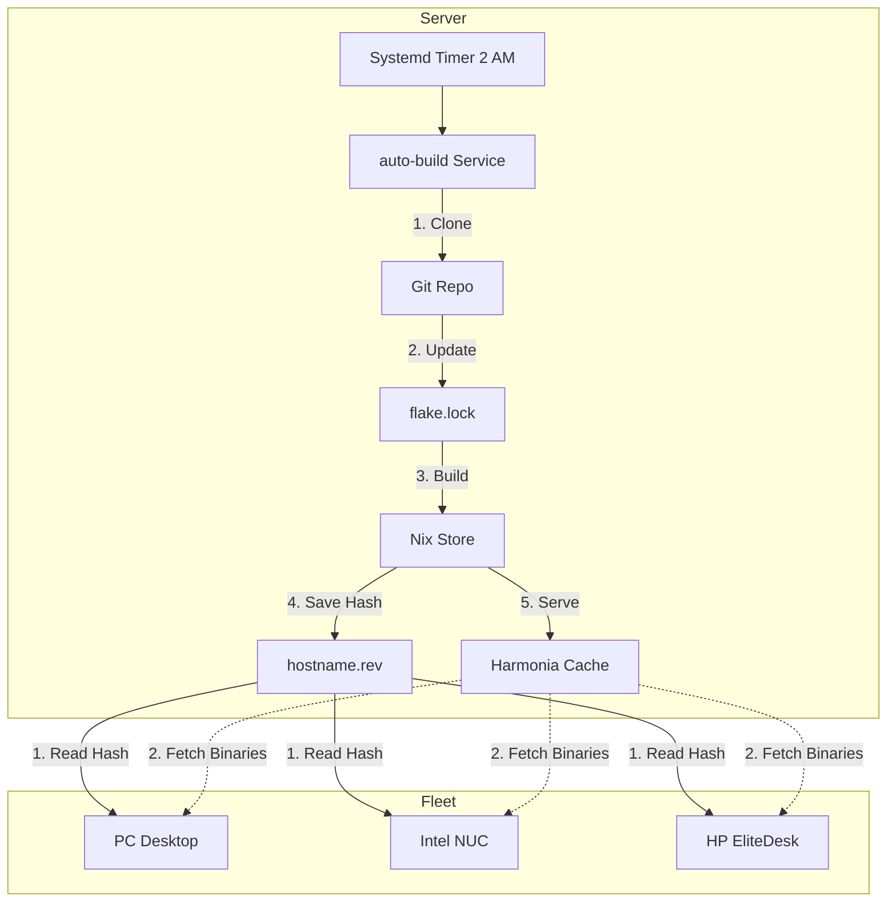

# The CUDA compilation nightmare: how I solved 18-hour builds with NixOS

I recently migrated my entire fleet to NixOS (read my [full migration story](/post/proxmox-migration/)).
If you use NixOS on `unstable` and have heavy dependencies, you've probably faced the dreaded "compiling from source" wall.

It starts innocently enough.

{}
**Update:** I recently discovered that a significant part of my "CUDA nightmare" was due to a change in the official CUDA binary cache URL.
It moved from `cuda-maintainers.cachix.org` to `https://cache.nixos-cuda.org`, and information about this was surprisingly sparse.
Once I added the [new cache URL](https://wiki.nixos.org/wiki/CUDA), many of the heavy builds simply disappeared because I could finally download them.
However, the architecture described below remains valuable for pinning `nixpkgs` revisions and avoiding compilation when upstream caches (Hydra or CUDA) are lagging behind `nixos-unstable`.
{}

## The Inspiration
You run `nixos-rebuild switch`, expecting a quick update.
Suddenly, Nix decides it needs to compile PyTorch with CUDA support, or even "standard" desktop apps like Firefox and Thunderbird, from scratch.

Your fans spin up to 100%.
Your RAM usage creeps up... 16GB, 32GB, 64GB.
The UI starts to stutter, the mouse freezes, and your music stops.
**OOM Killer** might save you, but often the system locks up completely.
There is no way to recover; you have to physically hit the reset button.
I recently installed `earlyoom`, which helps avoid the total system lockup by killing the process before the kernel panics.
But that is a hollow victory.
It is incredibly frustrating to have a build run for 5 hours across 24 cores at 100% usage, only to be killed right at the linking stage.
The result is the same: I didn't get my update, and I wasted a lot of electricity.

To fix this, you try the safe route: `--cores 1 --max-jobs 1`.
It works, but now your update takes **18 hours**.
During that time, you can't easily iterate on your system configuration because the Nix lock is held, and your CPU is busy.

I solved this by building a dedicated, automated build cache that effectively "pins" my entire fleet to a nightly snapshot.
Here is how it works.

## The Inspiration

This entire setup was born from a "nerd snipe" just 5 days ago.
I was comparing NixOS configurations with a colleague (see [his config](https://github.com/aos/nix-config)), and he mentioned he ran his own cache server.
It instantly clicked.
This was the missing piece.
A dedicated cache server wouldn't just be "nice to have"—it was the definitive solution to my OOM crashes and 18-hour compilation marathons.

## The Architecture

The core idea is simple: **Never compile heavy packages on your daily driver.**

I manage 3 physical NixOS machines (`pc`, `nuc`, `hp`), and updating them individually was becoming a chore.
So, I set up a dedicated build server (an LXC container named `nix-cache`) that does the heavy lifting overnight for the entire fleet.
Here is the high-level workflow:



### 1. The Build Server (`nix-cache`)

Every night at 2 AM, a systemd timer triggers my [`auto-build` service](https://github.com/basnijholt/dotfiles/blob/4f534bf32fb4396dd86ce631dec00717eab7656d/configs/nixos/hosts/nix-cache/auto-build.nix).
This service:
1.  Pulls the latest `dotfiles` from git.
2.  Updates the `flake.lock`.
3.  **Crucially:** Extracts the exact commit hash of `nixpkgs` it just locked.
4.  Builds the system configurations for all my machines (`pc`, `nuc`, `hp`) using conservative settings (`--cores 1`) to ensure stability.
5.  Saves the successful `nixpkgs` commit hash to a simple text file: `/var/lib/nix-auto-build/<hostname>.rev`.

### 2. The Binary Cache (Harmonia)

The build server runs [Harmonia](https://github.com/nix-community/harmonia), a lightweight binary cache.
Since the builds finished successfully on the server, all the resulting binaries (the "store paths") are now waiting in the server's nix store, ready to be served over HTTP.
You can see my Harmonia configuration [here](https://github.com/basnijholt/dotfiles/blob/4f534bf32fb4396dd86ce631dec00717eab7656d/configs/nixos/hosts/nix-cache/harmonia.nix).

### 3. The Client (`nixcacheupdate`)

This is the key mechanism.
On my workstation, I don't just run `nix flake update` (which would likely grab a slightly newer version of nixpkgs than my server built, causing a cache miss).

Instead, I use a custom script, [`upgrade-from-cache.sh`](https://github.com/basnijholt/dotfiles/blob/4f534bf32fb4396dd86ce631dec00717eab7656d/configs/nixos/upgrade-from-cache.sh), which I aliased to `nixcacheupdate`.
This script:
1.  SSHs into the build server and asks: *"What commit did you successfully build for me last night?"*
2.  Reads the hash from the `.rev` file.
3.  Runs the rebuild with a forced override:
    ```bash
    nixos-rebuild switch \
      --flake .#pc \
      --override-input nixpkgs github:NixOS/nixpkgs/<REMOTE_COMMIT_HASH>
    ```

## The benefits

1.  **Guaranteed Cache Hits:** My workstation is mathematically forced to use the exact same package inputs as the server.
    Nix calculates the hash, sees the match in the Harmonia cache, and downloads the binary instead of compiling it.
2.  **No More OOMs:** The heavy lifting happens on a machine where I don't care if the build is slow or memory-intensive.
3.  **Iterate Faster:** I can still tweak my local configuration files (`configuration.nix`, `home.nix`).
    Since changing a config file doesn't alter the *source code* of PyTorch, I still get the heavy binaries from the cache, while only locally building the tiny activation scripts.

## The Result

What used to be a frightening, system-freezing event is now a boring, fast download.
I get the stability of a frozen release with the freshness of `nixos-unstable`, minus the compilation heat.

If you are struggling with CUDA builds on NixOS, stop compiling locally.
Let a server take the heat.
